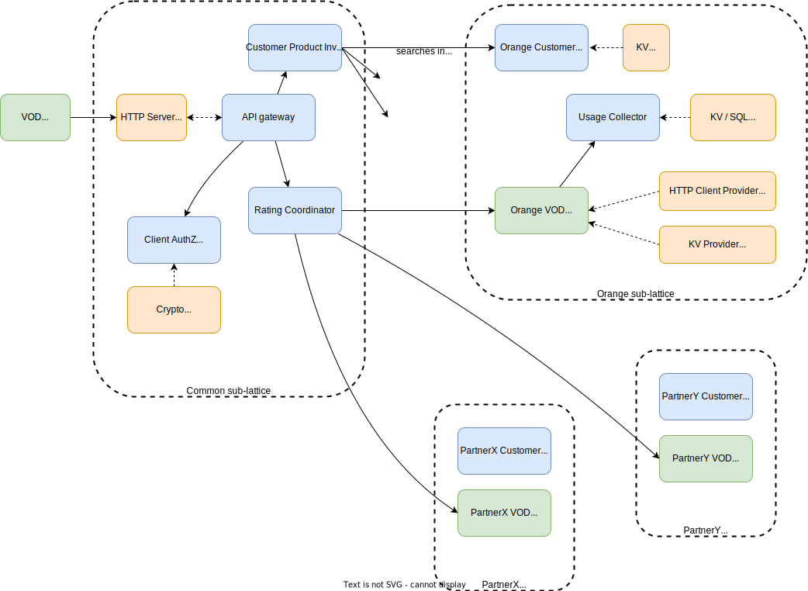

# Seeding data
  prerequiests:
   - Redis installed
   - Redis cli installed
 - Open Folder "seeding" in project
 - run the sh file "seed.sh"

# to deploy the app
  prerequiests:
    - wash installed v 20
    - redis kv store installed 
  - run sh file "start.sh" and give the version of the wadm file as a paramter ex: "./start.sh 0.0.1"  , this will stop the wash and start it again ,  deploy this version 

# distributed-rating-poc
Proof of concept illustrating a sample implementation of wasmCloud-based distributed rating

